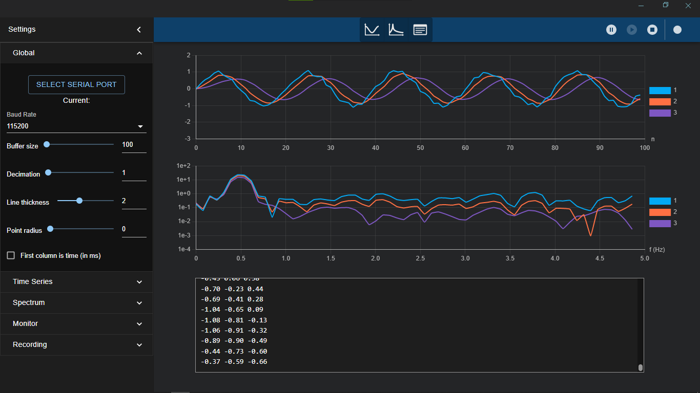

# DigitalFilter_dff Library

The `DigitalFilter_dff` library provides an implementation of discrete digital filters for signal processing. It is designed for use in embedded systems such as Arduino and ESP32 boards.

Experimental library. Minimal tested, so usage remarks and comments are welcome.

## Features
- **Moving Average Filter**: A simple n-point moving average filter.
- **Exponentially Weighted Moving Average (EWMA) Low Pass Filter**: A low-pass filter with a configurable cutoff frequency and sampling rate.

## Installation
1. Copy the `DigitalFilter.h` and `DigitalFilter.cpp` files into your Arduino project's `lib/DigitalFilter_dff/` directory if you are using PlatformIO in VS Code.
2. If you are using the Arduino IDE, place the `DigitalFilter_dff` folder in your Arduino libraries directory (e.g.,`C:\Users\<YourUsername>\Documents\Arduino\libraries\DigitalFilter_dff\`).
3. Alternatively, clone the repository directly into your libraries folder using the following command:

   ```bash
   git clone https://github.com/bulb-light/DigitalFilter_dff.git <path_to_libraries_folder>
   ```

## Usage
Include the library in your project:
```cpp
#include <DigitalFilter.h>
```
### API Reference

#### Class: `DigitalFilter`
The `DigitalFilter` class provides an implementation of discrete digital filters for signal processing.

#### Enum: `DigitalFilter::Type`
Enumeration for the types of digital filters supported:
- `MovingAverage`: Simple n-point Moving Average Filter.
- `EWMALowPass`: Exponentially Weighted Moving Average Low Pass Filter.

#### Constructors

1. **`DigitalFilter(DigitalFilter::Type type, int windowSize)`**
   - **Description**: Constructor for the Moving Average Filter.
   - **Parameters**:
     - `type`: The type of filter (should be `DigitalFilter::Type::MovingAverage`).
     - `windowSize`: The size of the moving average window.

2. **`DigitalFilter(DigitalFilter::Type type, float cutoffFrequency, float samplingRate)`**
   - **Description**: Constructor for the EWMA Low Pass Filter.
   - **Parameters**:
     - `type`: The type of filter (should be `DigitalFilter::Type::EWMALowPass`).
     - `cutoffFrequency`: The cutoff frequency for the low pass filter.
     - `samplingRate`: The sampling rate of the input signal.

#### Methods

1. **`void reset()`**
   - **Description**: Resets the internal states of the filter.

2. **`float computeFilterOut(float input)`**
   - **Description**: Computes the output of the filter for a given input sample.
   - **Parameters**:
     - `input`: The input sample to process.
   - **Returns**: The filtered output.

#### Private Methods

1. **`float applyMovingAverage(float input)`**
   - **Description**: Internal helper function to compute the Moving Average filter output.
   - **Parameters**:
     - `input`: The input sample to process.
   - **Returns**: The filtered output.

2. **`float applyEWMALowPass(float input)`**
   - **Description**: Internal helper function to compute the EWMA Low Pass filter output.
   - **Parameters**:
     - `input`: The input sample to process.
   - **Returns**: The filtered output.

## Example

Below is an example using the `DigitalFilter_dff` library ([DigitalFilterExample.cpp](examples/DigitalFilterExample.cpp)).

```cpp
#include <Arduino.h>
#include "DigitalFilter.h"

// Define constants
const int windowSize = 10; // Window size for Moving Average Filter
const float cutoffFrequency = 1.0; // Cutoff frequency for EWMA Low Pass Filter (Hz)
const float samplingRate = 10.0; // Sampling rate (Hz)
const int numSamples = 100; // Number of samples to generate

// Create filter instances
DigitalFilter movingAverageFilter(DigitalFilter::Type::MovingAverage, windowSize);
DigitalFilter ewmaLowPassFilter(DigitalFilter::Type::EWMALowPass, cutoffFrequency, samplingRate);

// Function to generate a noisy sine wave
void generateNoisySineWave(float* signal, int length, float amplitude, float frequency, float noiseLevel) {
    for (int i = 0; i < length; ++i) {
        float t = i / samplingRate; // Time in seconds
        float sineValue = amplitude * sin(2 * PI * frequency * t);
        // Random noise from -0.5*noiseLevel to +0.5*noiseLevel
        float noise = noiseLevel * ((float)rand() / RAND_MAX - 0.5f);
        signal[i] = sineValue + noise;
    }
}

// Function to generate a ramp signal
void generateTestArray(float* signal, int length) {
    for (int i = 0; i < length; ++i) {
        signal[i] = (float)i; // Simple ramp signal
    }
}

void setup() {
    // Initialize serial communication
    Serial.begin(115200);
    while (!Serial) {
        ; // Wait for serial port to connect (needed for some boards)
    }

    // Serial.println("\nDigitalFilter Library Test");
    // Serial.println("===========================");

    // Test EWMA Low Pass Filter and Moving Average Filter with a noisy sine wave
    // Generate a noisy sine wave
    float testSignal[numSamples];
    // Amplitude=1.0, Frequency=0.5Hz, NoiseLevel=0.3
    generateNoisySineWave(testSignal, numSamples, 1.0, 0.5, 0.3);
    // Process the noisy sine wave with the EWMA Low Pass Filter
    Serial.println("\nNoisy Sine Wave Filtered Output:");
    for (int i = 0; i < numSamples; ++i) {
        float filteredOutputEWMA = ewmaLowPassFilter.computeFilterOut(testSignal[i]);
        float filteredOutputMA = movingAverageFilter.computeFilterOut(testSignal[i]);
        // Serial.print("Input: ");
        Serial.print(testSignal[i]);
        // Serial.print(" -> Filtered Output: ");
        Serial.print(" ");
        Serial.print(filteredOutputEWMA);
        Serial.print(" ");
        Serial.println(filteredOutputMA);

        // Simulate real-time sampling (100 ms delay for 10Hz sampling rate)
        delay((int)(1/samplingRate * 1000));
    };

    // Reset the filter states
    ewmaLowPassFilter.reset();
    movingAverageFilter.reset();

    // NOTE: Uncomment the following block to test the Moving Average Filter
    // with a ramp signal

    // Test Moving Average Filter with a ramp signal
    // Generate a ramp signal
    // float rampSignal[numSamples];
    // generateTestArray(rampSignal, numSamples);
    // // Process the ramp signal with the Moving Average Filter
    // Serial.println("\nRamp Signal Filtered Output (Moving Average filter):");
    // for (int i = 0; i < numSamples; ++i) {
    //     float filteredOutput = movingAverageFilter.computeFilterOut(rampSignal[i]);
    //     Serial.print(rampSignal[i]);
    //     Serial.print(" ");
    //     Serial.println(filteredOutput);

    //     // Simulate real-time sampling (arbitrary 10 ms delay)
    //     delay(10);
    // }

    // Reset the filter states
    movingAverageFilter.reset();
}

void loop() {
    // Do nothing in the loop
}

```

The result of the example is shown in the following figure, where the blue line represents the unfiltered signal, the red line is the **EWMA low-pass** filter output, and the purple line represents the **Moving Average** filter output:

<p align="center">
    
</p>

## Notes

- Ensure that the `computeFilterOut(float input)` method is called at a fixed interval defined by the sampling time $T_s = 1/f_s$.

## Mathematical Background

### Moving Average Filter
The Moving Average Filter is a simple and effective method for smoothing a signal by averaging a fixed number of consecutive samples. It is defined as:

$$
Y[n] = \frac{1}{N} \sum_{i=0}^{N-1} X[n-i]
$$

Where:
- $ Y[n] $: The filtered output at the current sample $n$.
- $ X[n] $: The input signal at the current sample $n$.
- $ N $: The window size (number of samples to average).

This filter is particularly effective for reducing high-frequency noise in a signal. However, it introduces a delay proportional to the window size $(N-1)/2$.

### Exponentially Weighted Moving Average (EWMA) Low Pass Filter
The EWMA Low Pass Filter is a recursive filter that applies an exponential weighting to the input signal. It is defined as:

$$
Y[n] = \alpha \cdot X[n] + (1 - \alpha) \cdot Y[n-1]
$$

Where:
- $ Y[n] $: The filtered output at the current sample $ n $.
- $ X[n] $: The input signal at the current sample $ n $.
- $ \alpha $: The smoothing factor, calculated as:
  $$
  \alpha = \frac{2 \pi f_c}{2 \pi f_c + f_s}
  $$
  - $ f_c $: The cutoff frequency of the filter.
  - $ f_s $: The sampling rate of the input signal.

The EWMA Low Pass Filter is computationally efficient and suitable for real-time applications. It is commonly used to smooth signals while preserving low-frequency components and attenuating high-frequency noise.

### Comparison
| Filter Type                | Strengths                          | Weaknesses                          |
|----------------------------|-------------------------------------|--------------------------------------|
| Moving Average Filter      | Simple to implement, effective for reducing high-frequency noise. | Introduces delay, less effective for rapidly changing signals. |
| EWMA Low Pass Filter       | Computationally efficient, smooths signals while preserving low-frequency components. | May not completely remove high-frequency noise for certain signals. |

These filters are used in signal processing applications, such as sensor data smoothing, noise reduction, and control systems.

## License
This library is licensed under the MIT License. See the [LICENSE](LICENSE) file for details.

---

## 📫 How to Reach Me

| Platform | Handle / Link |
|---|---|
| Email | davidcs.ee.10@gmail.com |
| LinkedIn | [david](https://www.linkedin.com/in/davidcsee/) |
| Tiktok | [david_dff_bulblight](https://www.tiktok.com/@david_dff_bulblight)|
| YouTube| [david-dff](https://www.youtube.com/@david-dff-bulblight)|

---

## 🔗 Connect & Collaborate

I’m open to collaboration on open source, side projects, or mentoring.  
Feel free to reach out!

If you appreciate my work, you can support its development and maintenance. Improve the quality of the libraries by providing issues and Pull Requests, or make a donation.

Thank you.